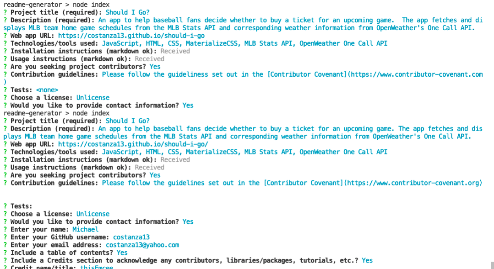
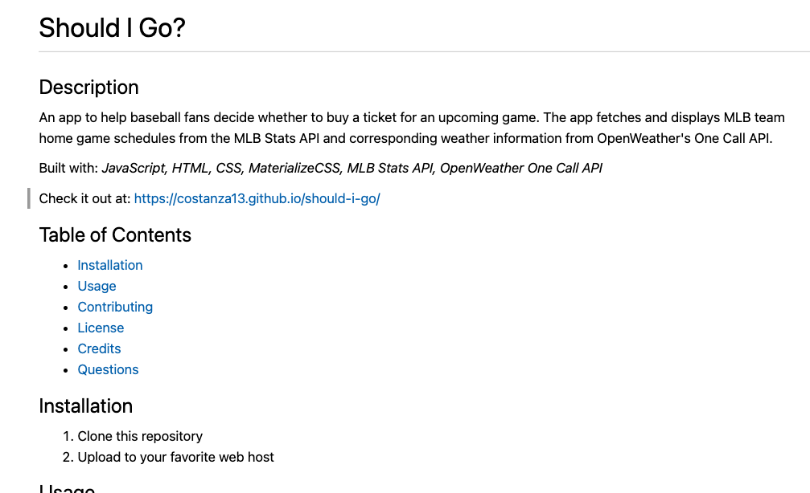

# Readme Generator

## Description 

A command-line Node.js application to assist developers in the task of creating a professional README file.

## Installation

1. Make sure recent version of Node.js and NPM are installed in your environment.
2. Clone this repository (https://github.com/costanza13/readme-generator).
3. Run `npm install` in the project's root directory to install the necessary modules.

## Usage

Run `node index` in the project's root directory and follow the prompts.

* See a video walkthrough [here](https://drive.google.com/file/d/1dLd415OsGcCFfzKQdLeymFKwoyIHY4_7/view?usp=sharing).

## License

 This software is made available under the [Unlicense](http://unlicense.org/) license.
